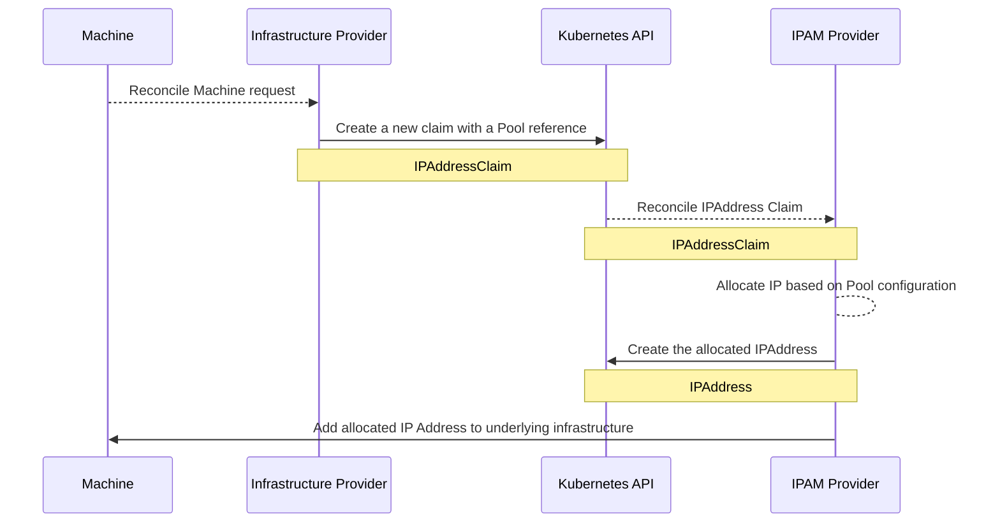

# Implementing a CAPI IPAM Provider

One of the oldest problems of Cluster API and Kubernetes cluster creation is managing the Nodes IPs.

While it is possible to rely on DHCP for the node IP allocation, and some other cloud providers have their own way of managing the IPs, for some enterprises and onpremises environments the dynamic IP approach doesn't applies, and there's a need for a more strict control on "who is using what IP".

Additionally, using dynamic IPs may be challenging, as for instance:
* Some DHCP implementations are not strict on the process of renewal
* The Kubernetes APIServer endpoint may be static, relying on a static IP or an FQDN associated with an IP
* Implementing a LoadBalancer controller that uses DHCP is kind of...problematic and complex (but kube-vip does it!!!)

The only other way of doing on Cluster API was to use static IPs on the Machine spec, but this approach reduces the possibility of templating and automating the Cluster creation.

**Note**: The source code for this PoC is available on https://github.com/rikatz/capi-phpipam/

This first part of the blog post will just implement the IPAM Provider :) 

I will probably update it to do some tests against CAPV soon :)

## The introduction of Cluster API IPAM
With the challenges above, the community created a new concept on Cluster API core called "[IPAM Provider](https://cluster-api.sigs.k8s.io/reference/glossary#ipam-provider)" that allows a user to specify "where should my nodes get their IPs from".

The following new resources where introduced:
* ipaddressclaims.ipam.cluster.x-k8s.io/v1alpha1 - A request for a new IP address
	* Contains just an object reference, for "which pool should the IP be allocated"
* ipaddress.ipam.cluster.x-k8s.io/v1alpha1 - The allocated IP Address
	* Contains a "response" from the IPAM Provider, with the allocated IP address, mask and gateway

So now, basically once you have an IPAM provider running on your cluster, you can create "IPAddressClaims" and receive "IPAddress" back. 

So with an IPAM provider running on the cluster, every new Node creation now should, instead of relying on DHCP, request for a new IP address claim, and use the response IPAddress as the node IP.


## Developing a new IPAM Provider

Based on the workflow below (and some additional assumptions), we need to support at least the following workflows:
* Allow a cluster admin to create a new IP pool to be consumed by the infrastructure provider
* Allow users (or infrastructure provider) to allocate a new IP address from the configured IPPool, to be added to the nodes (or consumed somewhere else)
* Allow users (or infrastructure provider) to deallocate previously allocated IP addresses

Besides this seems a "simple" workflow, there's a bunch of logics behind to make it work and adhere with Cluster API contracts. 

With this complexity in mind, Cluster API community did a "Reference and Generic implementation" called [InCluster provider](https://github.com/kubernetes-sigs/cluster-api-ipam-provider-in-cluster) that can be used both as a real IPAM implementation, as also as a reference library for other providers.

We will be using this library for our example

### Our IPAM software
For our implementation, we will use [phpIPAM](https://github.com/phpipam/phpipam). It is a widely used IPAM, and it can be ran easily with [docker-compose](https://github.com/phpipam-docker/phpipam-docker?tab=readme-ov-file#docker-standalone). Also, phpIPAM has a simple [API](https://phpipam.net/api/api_documentation/) that can be used for our needs.

We will not cover phpIPAM installation, but it should be straightforward to get it running.

In the end of phpIPAM installation and configuration we should have a subnet configured and ready to be used as:

**Note** The API management needs to be enabled on phpIPAM, under Administration / phpIPAM settings. Then a new API Key should be created under Administration / API, with the type "User token".
**Note2** If you are using docker-compose, inside the container, on the file `/phpipam/config.dist.php` change the directive `api_allow_unsafe` to `true` 
### Creating our phpIPAM Go client

As we will need to allocate and deallocate IPAddress, let's write our phpIPAM Client:

```go
package ipamclient

import (
	"fmt"

	"github.com/pavel-z1/phpipam-sdk-go/controllers/addresses"
	"github.com/pavel-z1/phpipam-sdk-go/controllers/subnets"
	"github.com/pavel-z1/phpipam-sdk-go/phpipam"
	"github.com/pavel-z1/phpipam-sdk-go/phpipam/session"
	"github.com/rikatz/capi-phpipam/api/v1alpha1"
)

type IPAMClient struct {
	subnetid int
	ctrl     *addresses.Controller
	subctrl  *subnets.Controller
}

type Subnet struct {
	Mask    string `json:"mask,omitempty"`
	Gateway struct {
		IPAddress string `json:"ip_addr,omitempty"`
	} `json:"gateway,omitempty"`
}

type addrId struct {
	ID        int    `json:"id,omitempty"`
	SubnetID  int    `json:"subnetId,omitempty"`
	IPAddress string `json:"ip,omitempty"`
}

// We create our new client with all the controllers already encapsulated
// TODO: Should support HTTPs and skip insecure :)
func NewIPAMClient(cfg phpipam.Config, subnetid int) *IPAMClient {
	sess := session.NewSession(cfg)
	return &IPAMClient{
		subnetid: subnetid,
		ctrl:     addresses.NewController(sess),
		subctrl:  subnets.NewController(sess),
	}
}

func (i *IPAMClient) GetAddress(hostname string) (string, error) {
	myaddr := make([]addrId, 0)

    // We just return a new address if it doesn't already exists
	err := i.ctrl.SendRequest("GET", fmt.Sprintf("/addresses/search_hostname/%s", hostname), &struct{}{}, &myaddr)
	if err == nil && len(myaddr) > 0 && myaddr[0].SubnetID == i.subnetid {
		return myaddr[0].IPAddress, nil
	}

	addr, err := i.ctrl.CreateFirstFreeAddress(i.subnetid, addresses.Address{Description: hostname, Hostname: hostname})
	if err != nil {
		return "", err
	}
	return addr, nil
}

func (i *IPAMClient) ReleaseAddress(hostname string) error {
	// The library is broken on addrStruct so we need a simple one just to get the allocated ID
	// TODO: Improve error handling, being able to check if the error is something like "not found"
	myaddr, err := i.searchForAddress(hostname)
	if err != nil {
		return fmt.Errorf("failed to find the address, maybe it doesn't exist anymore? %w", err)
	}

	_, err = i.ctrl.DeleteAddress(myaddr.ID, false)
	if err != nil {
		return err
	}
	return nil
}

func (i *IPAMClient) GetSubnetConfig() (*Subnet, error) {
	var subnet Subnet
	err := i.subctrl.SendRequest("GET", fmt.Sprintf("/subnets/%d/", i.subnetid), &struct{}{}, &subnet)
	if err != nil {
		return nil, err
	}
	return &subnet, nil
}

func (i *IPAMClient) searchForAddress(hostname string) (*addrId, error) {
	myaddr := make([]addrId, 0)

	err := i.ctrl.SendRequest("GET", fmt.Sprintf("/addresses/search_hostname/%s", hostname), &struct{}{}, &myaddr)
	if err == nil && len(myaddr) > 0 && myaddr[0].SubnetID == i.subnetid {
		return &myaddr[0], nil
	}
	return nil, err
}

func SpecToClient(spec *v1alpha1.PHPIPAMPoolSpec) (*IPAMClient, error) {
	if spec == nil {
		return nil, fmt.Errorf("spec cannot be null")
	}

	if spec.SubnetID < 0 || spec.Credentials == nil {
		return nil, fmt.Errorf("subnet id and credentials are required")
	}

	return NewIPAMClient(phpipam.Config{
		AppID:    spec.Credentials.AppID,
		Username: spec.Credentials.Username,
		Password: spec.Credentials.Password,
		Endpoint: spec.Credentials.Endpoint,
	}, spec.SubnetID), nil
}```

This library will be responsible to allocate / deallocate addresses and get the right configurations from our subnet.
**Note** This code may have changed over time, look at the repo for the latest available version
### Writing the CAPI IPAM controller
Writing the IPAM controller starts with the definition of the Pool API and controller, which will be the resource where the cluster admin will define the IPAM software configuration.

After that, CAPI IPAM requires two more implementations: the Claim Handler, responsible for getting and releasing an IP address from our IPAM, and the IPAM Adapter, that will serve as a middle layer between CAPI IPAM generic controller and our specific IPAM implementation. 

#### The Pool controller
As part of the implementation, we need a "way" to let the controller know which IPAddress it owns, and also how it should allocate IP Addresses and communicate with the underlying IPAM. Let's take as an example the definition of an in-cluster IPPool:

```yaml
apiVersion: ipam.cluster.x-k8s.io/v1alpha2
kind: InClusterIPPool
metadata:
  name: inclusterippool-sample
spec:
  addresses:
    - 10.0.0.0/24
  prefix: 24
  gateway: 10.0.0.1
```

Looking at this IPPool example, we can see the definition of "how the controller should behave when allocating IPs". Later on, we refer  `inclusterippool-sample` when requesting new IPs.

For phpIPAM we have already configured our IPPool, but we need to tell the controller some other informations, like "what credentials to use" and "what subnet should be consumed". Something as below (not ideal, I know, but good for our experiment)
```yaml
apiVersion: ipam.cluster.x-k8s.io/v1alpha2
kind: PHPIPAMPool
metadata:
  name: mypool
spec:
  subnetid: 7 # You get this from phpipam UI
  appid: capi123 # Created with the APIKey when configuring PHPIPAM
  username: admin # You shouldn't do it, but I'm lazy!
  password: password
  endpoint: http://127.0.0.1/api
```

I'm not going to write the whole go code for the API spec, but it should be available on Github. On the implementation of the PHPIPAMIPPool reconciliation, what matters to us is:

```go
// Reconcile the IPPool and set it as ready
func (r *PHPIPAMIPPoolReconciler) Reconcile(ctx context.Context, req ctrl.Request) (ctrl.Result, error) {

	ippoollogger = log.FromContext(ctx).WithName("PHPIPAM ippool")
	ippoollogger.Info("received reconciliation", "request", req.NamespacedName.String())

	var ippool ipamv1alpha1.PHPIPAMIPPool
	if err := r.Get(ctx, req.NamespacedName, &ippool); err != nil {
		if k8serrors.IsNotFound(err) {
			return ctrl.Result{}, nil
		}
		ippoollogger.Error(err, "unable to get ippool")
		return ctrl.Result{}, err
	}

	ipamcl, err := ipamclient.SpecToClient(&ippool.Spec)
	if err != nil {
		return r.ConditionsWithErrors(ctx, req, &ippool, ipamv1alpha1.ConditionReasonInvalidPHPIPam, "PHPIPAMconfig configuration is invalid: "+err.Error(), true)

	}

	subnetCfg, err := ipamcl.GetSubnetConfig()
	if err != nil {
		return r.ConditionsWithErrors(ctx, req, &ippool, ipamv1alpha1.ConditionReasonInvalidCreds, "failed to login to phpipam: "+err.Error(), false)
	}
	ippool.Status.Gateway = subnetCfg.Gateway.IPAddress
	ippool.Status.Mask = subnetCfg.Mask
	r.ipamcl = ipamcl
	return r.SetReady(ctx, req, &ippool)
}
```

After installing the CRDs, building and running the controller, we can create the following IPPool and check if the controller is able to reconcile it:

```yaml
apiVersion: ipam.cluster.x-k8s.io/v1alpha1
kind: PHPIPAMIPPool
metadata:
  name: my-ipam-test
spec:
  subnetid: 7
  credentials:
    username: admin
    password: "12qw!@QW"
    app_id: capi123
    endpoint: "http://127.0.0.1/api"
```
And getting its status should return:
```yaml
status:
  conditions:
  - lastTransitionTime: "2024-02-20T17:15:05Z"
    message: IPPool is ready
    reason: IPPoolReady
    status: "True"
    type: Ready
  gateway: 192.168.0.1
  mask: "24"
```

#### The Claim Handler

The [Claim Handler](https://pkg.go.dev/sigs.k8s.io/cluster-api-ipam-provider-in-cluster@v0.1.0/pkg/ipamutil#ClaimHandler) is the responsible for the real communication between the controller and the IPAM software.

It will be called for every new IPAddress/IPAddressClaim reconciliation

This interface implementation requires that 3 methods are defined:
* A method called "FetchPool" that will be the first method called, to get the Pool requested from IPAddressClaim and populate the required structures
* A method called EnsureAddress that is responsible to check or allocate a new address for the claim
* A method called ReleaseAddress that is responsible to release the address back to the Pool

The handler implementation will look something like:
```go
package ipaddress

import (
	"context"
	"fmt"
	"strconv"

	"github.com/pkg/errors"
	"k8s.io/apimachinery/pkg/types"
	"sigs.k8s.io/cluster-api-ipam-provider-in-cluster/pkg/ipamutil"
	ipamv1 "sigs.k8s.io/cluster-api/exp/ipam/api/v1beta1"
	ctrl "sigs.k8s.io/controller-runtime"
	"sigs.k8s.io/controller-runtime/pkg/client"

	"github.com/rikatz/capi-phpipam/api/v1alpha1"
	"github.com/rikatz/capi-phpipam/pkg/ipamclient"
)

// IPAddressClaimHandler reconciles an IPAddress Claim getting the right address from the right pool
type IPAddressClaimHandler struct {
	client.Client
	claim   *ipamv1.IPAddressClaim
	mask    int
	gateway string
	ipamcl  *ipamclient.IPAMClient
}

var _ ipamutil.ClaimHandler = &IPAddressClaimHandler{}

// FetchPool fetches the PHPIPAM Pool.
func (h *IPAddressClaimHandler) FetchPool(ctx context.Context) (client.Object, *ctrl.Result, error) {

	var err error
	phpipampool := &v1alpha1.PHPIPAMIPPool{}

	if err = h.Client.Get(ctx, types.NamespacedName{Namespace: h.claim.Namespace, Name: h.claim.Spec.PoolRef.Name}, phpipampool); err != nil {
		return nil, nil, errors.Wrap(err, "failed to fetch pool")
	}

	if phpipampool.Status.Mask == "" || phpipampool.Status.Gateway == "" || !v1alpha1.PoolHasReadyCondition(phpipampool.Status) {
		return nil, nil, fmt.Errorf("IPPool is not ready yet")
	}

	h.mask, err = strconv.Atoi(phpipampool.Status.Mask)
	if err != nil {
		return nil, nil, fmt.Errorf("pool contains invalid network mask")
	}
	h.gateway = phpipampool.Status.Gateway
    
    ipamcl, err := ipamclient.SpecToClient(&phpipampool.Spec)
	if err != nil {
		return nil, nil, err
	}
	h.ipamcl = ipamcl
	return phpipampool, nil, nil
}

// EnsureAddress ensures that the IPAddress contains a valid address.
func (h *IPAddressClaimHandler) EnsureAddress(ctx context.Context, address *ipamv1.IPAddress) (*ctrl.Result, error) {
	hostname := fmt.Sprintf("%s.%s", h.claim.GetName(), h.claim.GetNamespace())
	ipv4, err := h.ipamcl.GetAddress(hostname)
	if err != nil {
		return nil, errors.Wrap(err, "failed to get an IP Address")
	}

	address.Spec.Address = ipv4
	address.Spec.Gateway = h.gateway
	address.Spec.Prefix = h.mask
	return nil, nil
}

// ReleaseAddress releases the ip address.
func (h *IPAddressClaimHandler) ReleaseAddress(ctx context.Context) (*ctrl.Result, error) {
	hostname := fmt.Sprintf("%s.%s", h.claim.GetName(), h.claim.GetNamespace())
	err := h.ipamcl.ReleaseAddress(hostname)
	return nil, err
}
```

#### The Provider Adapter
The [Provider Adapter](https://pkg.go.dev/sigs.k8s.io/cluster-api-ipam-provider-in-cluster@v0.1.0/pkg/ipamutil#ProviderAdapter) implements the middle layer between the generic IPAM reconciler and our specific IPAM Handler.

Its function is to, first allow the Generic controller to setup a new manager for the IPAddressClaim and IPAddress and also, to get the proper ClaimHandler.

The Provider Adapter also has some specific needs (like setting a new Index and some common functions) that will not be part of the snippet, and hopefully we can integrate and migrate into the Generic reconciler

```go
// PHPIPAMProviderAdapter is used as middle layer for provider integration.
type PHPIPAMProviderAdapter struct {
	Client     client.Client
	IPAMClient *ipamclient.IPAMClient
}

var _ ipamutil.ProviderAdapter = &PHPIPAMProviderAdapter{}

// SetupWithManager sets up the controller with the Manager.
func (v *PHPIPAMProviderAdapter) SetupWithManager(_ context.Context, b *ctrl.Builder) error {
	b.
		For(&ipamv1.IPAddressClaim{}, builder.WithPredicates(
			ipampredicates.ClaimReferencesPoolKind(metav1.GroupKind{
				Group: v1alpha1.GroupVersion.Group,
				Kind:  v1alpha1.PHPIPAMPoolKind,
			}),
		)).
		WithOptions(controller.Options{
			// To avoid race conditions when allocating IP Addresses, we explicitly set this to 1
			MaxConcurrentReconciles: 1,
		}).
		Watches(
			&v1alpha1.PHPIPAMIPPool{},
			handler.EnqueueRequestsFromMapFunc(v.IPPoolToIPClaims()),
			builder.WithPredicates(resourceTransitionedToUnpaused()),
		).
		Owns(&ipamv1.IPAddress{}, builder.WithPredicates(
			ipampredicates.AddressReferencesPoolKind(metav1.GroupKind{
				Group: v1alpha1.GroupVersion.Group,
				Kind:  v1alpha1.PHPIPAMPoolKind,
			}),
		))
	return nil
}

// ClaimHandlerFor returns a claim handler for a specific claim.
func (v *PHPIPAMProviderAdapter) ClaimHandlerFor(_ client.Client, claim *ipamv1.IPAddressClaim) ipamutil.ClaimHandler {
	return &IPAddressClaimHandler{
		Client: v.Client,
		claim:  claim,
	}
}
```
As we can see, it is a simple middle layer between a reconciler and the real IPAM logic code.

#### Testing if it works
Putting all together, and with the proper "main.go" file (look at the repo!), we can test if the IP allocation works

**Note** Don't forget to install the Cluster API core CRDs first with:
```shell
kubectl apply -f https://raw.githubusercontent.com/kubernetes-sigs/cluster-api/main/config/crd/bases/ipam.cluster.x-k8s.io_ipaddressclaims.yaml
kubectl apply -f https://raw.githubusercontent.com/kubernetes-sigs/cluster-api/main/config/crd/bases/ipam.cluster.x-k8s.io_ipaddresses.yaml
kubectl apply -f https://raw.githubusercontent.com/kubernetes-sigs/cluster-api/main/config/crd/bases/cluster.x-k8s.io_clusters.yaml
```

With the controller running and able to reach phpIPAM, and with the `PHPIPAMIPPool` properly defined, we can create a new `IPAddressClaim` using our pool, and check if an IP Address is allocated:
```yaml
apiVersion: ipam.cluster.x-k8s.io/v1alpha1
kind: IPAddressClaim
metadata:
  name: first-ip
  namespace: default
spec:
  poolRef:
    apiGroup: ipam.cluster.x-k8s.io
    kind: PHPIPAMIPPool
    name: my-ipam-test
```
After we apply this object, the controller should go to phpIPAM and gets us in return an `IPAddress` with the same name and an IP allocated, which we can later verify on phpIPAM:

```yaml
# kubectl get ipaddress first-ip -o yaml
kind: IPAddress
metadata:
  name: first-ip
  namespace: default
.....
spec:
  address: 192.168.0.11 # This was filled by our controller
  claimRef:
    name: first-ip
  gateway: 192.168.0.1
  poolRef:
    apiGroup: ipam.cluster.x-k8s.io
    kind: PHPIPAMIPPool
    name: my-ipam-test
  prefix: 24
```
And on phpIPAM:


